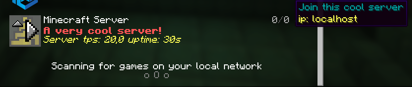
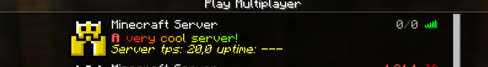

# Custom MOTD
This mod gives you access to customize your server join screen.
You can change your MOTD, icon, player count, max players and the hover players.
It also supports [Placeholder API](https://modrinth.com/mod/placeholder-api).

The icon is now a link instead of locally. Why?, this is because you can now have a link that has a changing picture, and it will update to it every 10 sec.

**Important** If you don't want one of the features you can easily turn them off bye commenting out them in the config.

# Example



# Config
```
#Motd text (uses vanilla system, use this tool https://mctools.org/motd-creator), You can also use the normal vannila color codes. They are located here (https://minecraft.wiki/w/Formatting_codes)
motd: A minecraft server

# From here remove "#" if you want to use a feature

#Potho link (use this if you want to change the photo at the same time as the server is running)

#link-to-photo: link

#If you want to change the max player count, (Only visual, not changing your player count)
#max-player-count: 420

#If you want to change the current player count, (Only visual)
#player-count: 69

#Hover text for player amount, max 12, (Only visual)
#plyer-list:
  #- steve
```